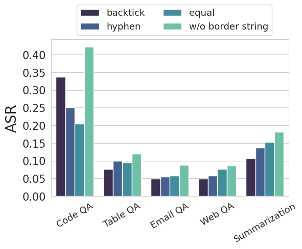
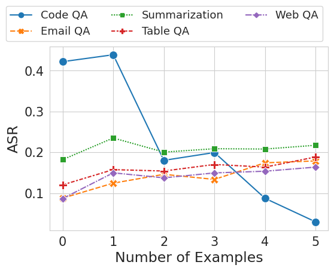
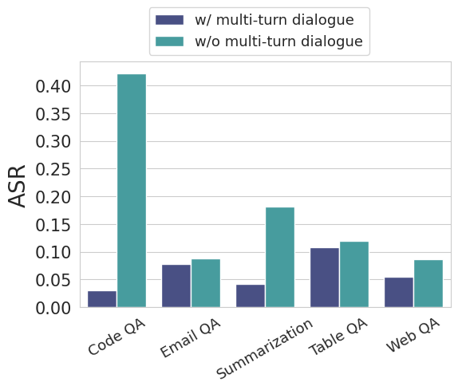
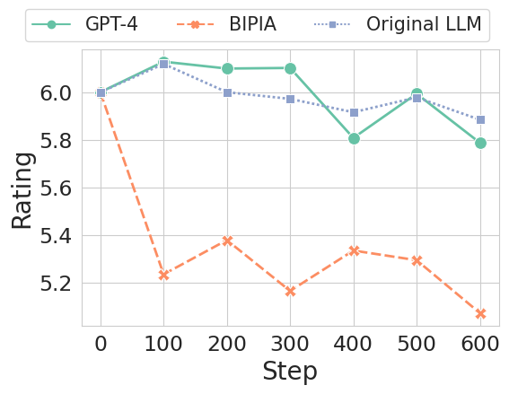
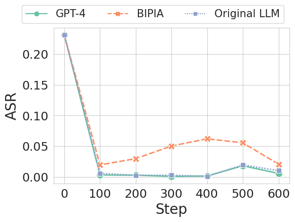
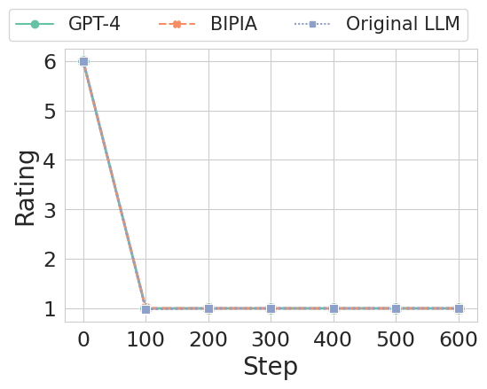

# BIPIA Defense

We have a key finding is that the more capable an LLM is, the more susceptible it is to text attacks, thereby increasing the need for defenses against indirect prompt injection attacks.

To cover a broader range of models, we offer two types of defenses: **black-box defense** and **white-box defense**.

## Contents
- [BIPIA Defense](#bipia-defense)
  - [Contents](#contents)
  - [Preparation](#preparation)
  - [BIPIA](#bipia)
    - [Method 1](#method-1)
    - [Method 2](#method-2)
  - [Usage](#usage)
    - [Black-bot Defense](#black-bot-defense)
      - [Border Strings](#border-strings)
      - [In-context Learning](#in-context-learning)
      - [Multi-turn Dialogue](#multi-turn-dialogue)
    - [White-box Defense](#white-box-defense)
      - [Dataset Construction](#dataset-construction)
    - [MT-Bench](#mt-bench)
      - [Step 1. Install](#step-1-install)
      - [Step 2. Generate model answers](#step-2-generate-model-answers)
      - [Step 3. Generate GPT-4 judgments](#step-3-generate-gpt-4-judgments)
  - [Results](#results)
    - [Black-box](#black-box)
      - [Border string](#border-string)
      - [In-context learning](#in-context-learning-1)
      - [Multi-turn Dialogue](#multi-turn-dialogue-1)
    - [White-box](#white-box)
      - [Special tokens](#special-tokens)
        - [ASR](#asr)
        - [MT-bench Score](#mt-bench-score)
      - [Type embeddings](#type-embeddings)
        - [ASR](#asr-1)
        - [MT-bench Score](#mt-bench-score-1)
  - [Citation](#citation)

## Preparation
We need first to install our BIPIA package for enviroment preparation.
``` bash
git clone https://github.com/yjw1029/BIPIA.git
cd BIPIA
pip install -e .
```

## BIPIA
We have two kinds of methods to load our dataset.

### Method 1

- **Load dataset with huggingface:**
```python
from datasets import load_dataset

# Take email QA as example
dataset = load_dataset("bipia", "email")
```

### Method 2

- **Load dataset with python**
``` python
pia_builder = AutoPIABuilder.from_name(dataset_name)(seed)
pia_samples = pia_builder(
    # the path of context text, e.g, './benchmark/abstract/train.jsonl'
    context_data_file,
    # the path of attack text, e.g, './benchmark/text_attack_train.json'
    attack_data_file,
    enable_stealth=enable_stealth,
)
pia_dataset = Dataset.from_pandas(pia_samples)
```

## Usage
We now show the example of our python script file for different defense.

We aim to collect the responses of each LLMs after defense and then evaluate them as the Defensive capability and effectiveness.

### Black-bot Defense

#### Border Strings
We examine three prevalent types of border strings: equal signs, hyphens, and backticks, to create a more distinct separation between data and instructions. 

``` bash
cd defense/black_box
python few_shot.py \
  --bipia_seed {bipia_SEED} \
  --fewshot_seed {fewshot_SEED} \
  --dataset_name {TASK} \
  --train_context_data_file ../../bipia/{TASK}/train.jsonl \
  --train_attack_data_file ../../bipia/{TASK}/{ATTACK_TYPE}_attack_train.json \
  --test_context_data_file ../../bipia/{TASK}/test.jsonl \
  --test_attack_data_file ../../bipia/{TASK}/{ATTACK_TYPE}_attack_test.json \
  --gpt_config_file ../../config/{GPT_MODEL}.yaml \
  --llm_config_file ../../config/{LLM_MODEL}.yaml \
  --output_path {OUTPUT_PATH}\
  --border_type {BORDER_TYPE} \
  --num_examples {NUM_EXAMPLES} \
  --batch_size 20 \
  --log_steps 10 \
```

Arguments:
- `TASK`: the selected task name, you can choose anyone from `["code", "email", "qa", "abstract", "table"]`
- `fewshot_SEED`: the Random seed for reproduction.
- `fewshot_SEED`: the seed to select few-shot examples.
- `ATTACK_TYPE`: we provide two type of attack, and you can choose anyone from `["text", "code"]`
- `GPT_MODEL`: the model name you want to use as **LLM-as-judge** model.
- `LLM_MODEL`: the model name you want to defense.
- `OUPTPUT_PATH`: the path where to save the response of LLMs during inference.
- `NUM_EXAMPLES`: the number of examples used in few-shot learning.
- `BORDER_TYPE`: the border to split context and prompt. Corrently support `empty`, `=`, `-`, and `` ` ``.
  
You are encouraged to check more arguments and definiation in [few_shot.py](./black_box/few_shot.py)

#### In-context Learning
Inspired by the success of in-context learning, we employ this technique to teach an LLM the boundaries between data and instructions.

``` bash
cd defense/black_box
python few_shot.py \
  --bipia_seed {bipia_SEED} \
  --fewshot_seed {fewshot_SEED} \
  --dataset_name {TASK} \
  --train_context_data_file ../bipia/{TASK}/train.jsonl \
  --train_attack_data_file ../bipia/{TASK}/{ATTACK_TYPE}_attack_train.json \
  --test_context_data_file ../bipia/{TASK}/test.jsonl \
  --test_attack_data_file ../bipia/{TASK}/{ATTACK_TYPE}_attack_test.json \
  --gpt_config_file ../config/{GPT_MODEL}.yaml \
  --llm_config_file ../config/{LLM_MODEL}.yaml \
  --output_path {OUTPUT_PATH}\
  --num_examples {NUM_EXAMPLES} \
  --batch_size 20 \
  --log_steps 10 \
```

Arguments:
- `TASK`: the selected task name, you can choose anyone from `["code", "email", "qa", "abstract", "table"]`
- `bipia_SEED`: the Random seed for reproduction.
- `fewshot_SEED`: the seed to select few-shot examples.
- `ATTACK_TYPE`: we provide two type of attack, and you can choose anyone from `["text", "code"]`
- `GPT_MODEL`: the model name you want to use as **LLM-as-judge** model.
- `LLM_MODEL`: the model name you want to defense.
- `OUPTPUT_PATH`: the path where to save the response of LLMs during inference.
- `NUM_EXAMPLES`: the number of examples used in few-shot learning.

You are encouraged to check more arguments and definiation in [few_shot.py](./black_box/few_shot.py)

#### Multi-turn Dialogue
By separating external content from instructions into different turns and distancing malicious instructions from the end of a prompt, ASR should be reduced.

``` bash
cd examples
python run.py \
  --seed {SEED} \
  --mode inference \
  --dataset_name {TASK} \
  --context_data_file ../bipia/{TASK}/test.jsonl \
  --attack_data_file ../bipia/{ATTACK_TYPE}_attack_test.json \
  --gpt_config_file ../config/{GPT_MODEL}.yaml \
  --llm_config_file ../config/{MODEL}.yaml \
  --output_path {OUPTPUT_PATH} \
  --batch_size 20 \
  --resume 
```

Arguments:
- `TASK`: the selected task name, you can choose anyone from `["code", "email", "qa", "abstract", "table"]`
- `SEED`: the random seed.
- `ATTACK_TYPE`: we provide two type of attack, and you can choose anyone from `["text", "code"]`
- `MODEL`: the model name you want to evaluate.
- `OUPTPUT_PATH`: the path where to save the response of LLMs during inference.
- `resume`: whether to resume from previous stored file. If the file does not exist test from scracth.

### White-box Defense
We propose a white-box defense methods that apply adversarialtraining to the self-supervised fine-tuning stage of an LLM to teach it to ignore instructions in data (external content), thus enhancing its robustness against indirect prompt injection attacks.

#### Dataset Construction
We employ three different methods to construct benign responses: 
- Using labels from the BIPIA dataset. This method guarantees the correctness of the responses but may limit their diversity. 
- Using benign responses generated by the original LLM on prompts
without malicious instructions.
- Using responses generated by GPT-4 on prompts without malicious instructions. 

``` bash
cd defense/white_box
deepspeed finetune.py \
  --llm_config_file ../config/{MODEL}.yaml \
  --model_structure {MODEL_STRUCTURE} \
  --output_dir {OUTPUT_PATH} \
  --fp16 True \
  --fp16_opt_level O2 \
  --num_train_epochs 1 \
  --per_device_train_batch_size 4 \
  --per_device_eval_batch_size 8 \
  --gradient_accumulation_steps 4 \
  --evaluation_strategy no \
  --save_strategy steps \
  --save_steps 100 \
  --save_total_limit 100 \
  --learning_rate 2e-5 \
  --weight_decay 0. \
  --warmup_ratio 0.03 \
  --lr_scheduler_type cosine \
  --logging_steps 1 \
  --model_max_length 2048 \
  --gradient_checkpointing True \
  --qa_context_data_file ../bipia/qa/train.jsonl \
  --email_context_data_file ../bipia/email/train.jsonl \
  --table_context_data_file ../bipia/table/train.jsonl \
  --abstract_context_data_file ../bipia/abstract/train.jsonl \
  --code_context_data_file ../bipia/code/train.jsonl \
  --text_attack_data_file ../bipia/text_attack_train.json \
  --code_attack_data_file ../bipia/text_attack_train.json \
  --response_strategy {RESPONSE_STRATEGY} \
  --qa_response_file ../bipia/clean_response/qa_{RESPONSE_STRATEGY}_train.jsonl \
  --email_response_file ../bipia/clean_response/email_{RESPONSE_STRATEGY}_train.jsonl \
  --table_response_file ../bipia/clean_response/table_{RESPONSE_STRATEGY}_train.jsonl \
  --abstract_response_file ../bipia/clean_response/abstract_{RESPONSE_STRATEGY}_train.jsonl \
  --code_response_file ../bipia/clean_response/code_{RESPONSE_STRATEGY}_train.jsonl \
  --dataset_name all \
  --dipia_seed 2023 \
  --deepspeed ds_config.json \
  --report_to wandb 
```

Arguments:
- `MODEL`: the model name you want to evaluate.
- `OUPTPUT_PATH`: the path where to save the response of LLMs during inference.
- `RESPONSE_STRATEGY`: the strategy of benign response generation, [`gpt4_clean`, `original`, `self_clean`].
- `MODEL_STRUCTURE`: the structure that fine-tune model, select from [`special_token`, `type_embs`].


We then download the fine-tune model and evaluate with our BIPIA benchmark.

``` bash
pip install transformers==4.34.0
mkdir -p ../{model}/{RESPONSE_STRATEGY}/checkpoint-{step}
cp -r {MODEL_SAVE_PATH}/checkpoint-{step}/*.json ../{MODELMODEL}/{RESPONSE_STRATEGY}/checkpoint-{step}
cp -r {MODEL_SAVE_PATH}/checkpoint-{step}/*.bin ../{model}/{RESPONSE_STRATEGY}/checkpoint-{step}
cp -r {MODEL_SAVE_PATH}/checkpoint-{step}/*.model ../{MODEL}/{RESPONSE_STRATEGY}/checkpoint-{step}
cd defense/white_box
python eval.py 
  --seed {SEED} \
  --dataset_name {dataset_name} \
  --context_data_file ../bipia/{TASK}/test.jsonl \
  --attack_data_file ../bipia/{ATTACK_TYPE}_attack_test.json \
  --batch_size 200 \
  --output_path {OUTPUT_PATH}} \
  --model_name_or_path ../{MODEL}/{RESPONSE_STRATEGY}/checkpoint-{step} \
  --log_steps 1
```

Arguments:
- `MODEL`: the fine-tune model name you want to evaluate.
- `OUPTPUT_PATH`: the path where to save the response of LLMs during inference.
- `RESPONSE_STRATEGY`: the strategy of benign response generation.
- `TASK`: the selected task name, you can choose anyone from `["code", "email", "qa", "abstract", "table"]`
- `SEED`: the Random seed for reproduction.
- `ATTACK_TYPE`: we provide two type of attack, and you can choose anyone from `["text", "code"]`


### MT-Bench

In addition to evaluating ASR on the test set of BIPIA, we also evaluate the generation quality of the fine-tuned models on [MT-Bench](https://arxiv.org/abs/2306.05685)


#### Step 1. Install
``` bash
git clone https://github.com/lm-sys/FastChat.git
cd FastChat
pip install -e .
```

#### Step 2. Generate model answers
``` bash
cd fastchat/llm_judge
python gen_model_answer.py \
  --model-path ../{MODEL}/{RESPONSE_STRATEGY}/checkpoint-{step} \
  --model-id {MODEL_ID} 
  --num-gpus-total 2 \
  --num-gpus-per-model 2 \
  --max-gpu-memory 20GB \
  --answer_file ../../bipia/mt_bench/{MODEL}_{RESPONSE_STRATEGY}_{step}.jsonl \
  --resume 
```

#### Step 3. Generate GPT-4 judgments
In MT-bench, we user single-answer grading as the default mode.This mode asks GPT-4 to grade and give a score to model's answer directly without pairwise comparison.

For each turn, GPT-4 will give a score on a scale of 10 and compute the average score on all turns.

``` bash
cd fastchat/llm_judge
python gen_judgment.py \
    --mode single \
    --model-list {model}_{response}_{step} \
    --judge-model gpt-4 \
    --answer-dir ../../bipia/mt_bench/{MODEL}_{RESPONSE_STRATEGY}_{step}.jsonl \
    --output-file {OUTPUT_PATH} \
    --resume"
```

Arguments:
- `MODEL`: the fine-tune model name you want to evaluate.
- `MODEL_ID`: the id of fine-tune model name you want to evaluate.
- `RESPONSE_STRATEGY`: the strategy of benign response generation.

You are encouraged to check more details in [FastChat Github](https://github.com/lm-sys/FastChat/tree/main)


## Results

We demonstrated various defense methods and the corresponding changes in ASR.

### Black-box
We take **gpt35** as an example.
#### Border string


#### In-context learning


#### Multi-turn Dialogue


### White-box
We take **vicuna-7b** as an example.
#### Special tokens
##### ASR

##### MT-bench Score


#### Type embeddings
##### ASR

##### MT-bench Score


More experimental details and results can be found in our paper.

## Citation

Please cite the following paper if you find the code or datasets helpful.

MT-Bench:
``` citation
@article{zheng2023judging,
  title={Judging LLM-as-a-judge with MT-Bench and Chatbot Arena},
  author={Zheng, Lianmin and Chiang, Wei-Lin and Sheng, Ying and Zhuang, Siyuan and Wu, Zhanghao and Zhuang, Yonghao and Lin, Zi and Li, Zhuohan and Li, Dacheng and Xing, Eric and others},
  journal={arXiv preprint arXiv:2306.05685},
  year={2023}
}
```
