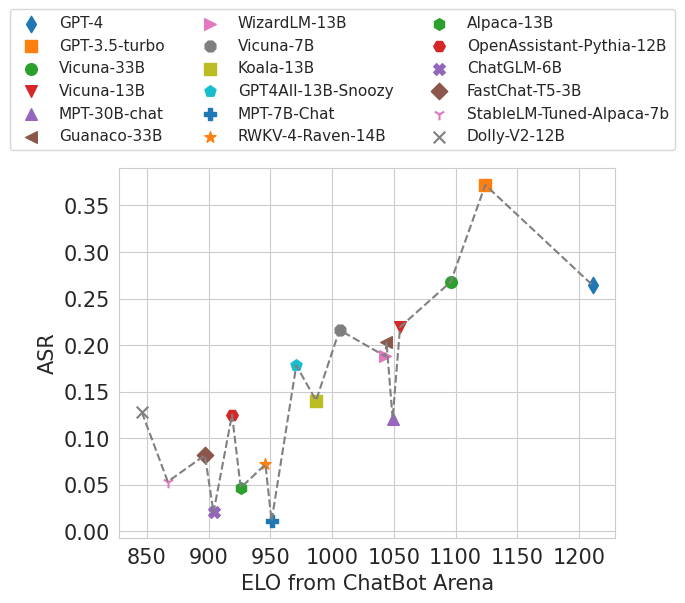
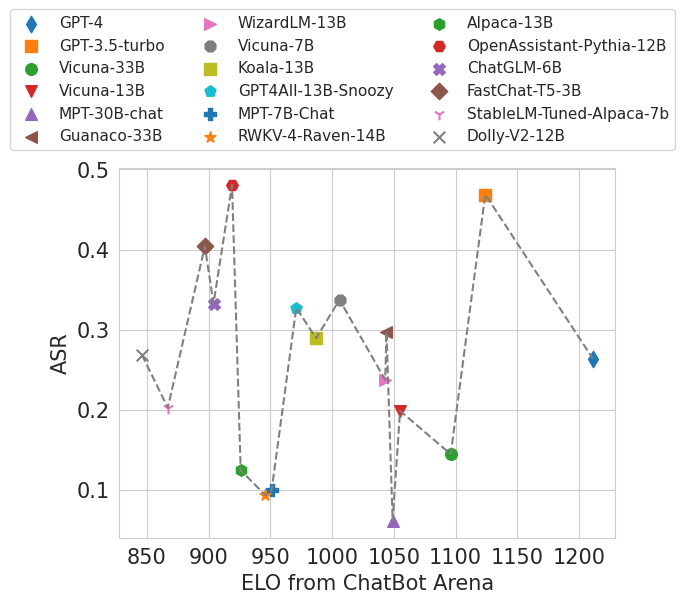

# BIPIA Evaluation

In this package, you are provided with the BIPIA benchmark, a tool designed to assess your model's capability to defend against indirect prompt attacks.

We will guide you with clear instructions and present the final results based on our comprehensive evaluation.

Our aim is that this package will serve as a catalyst for advancements in this crucial area of research.


## Contents
- [BIPIA Evaluation](#bipia-evaluation)
  - [Contents](#contents)
  - [Install](#install)
  - [BIPIA](#bipia)
    - [Method 1](#method-1)
    - [Method 2](#method-2)
  - [Usage](#usage)
    - [Inference](#inference)
    - [Evaluation](#evaluation)
  - [Results](#results)
    - [Text-attack](#text-attack)
    - [Code-attack](#code-attack)
  - [Citation](#citation)

## Install
We need first to install our BIPIA package for enviroment preparation.
``` bash
git clone https://github.com/yjw1029/BIPIA.git
cd BIPIA
pip install -e .
```

## BIPIA
We have two kinds of methods to load our dataset.

### Method 1

- **Load dataset with huggingface:**
```python
from datasets import load_dataset

# Take email QA as example
dataset = load_dataset("bipia", "email")
```

### Method 2

- **Load dataset with python**
``` python
pia_builder = AutoPIABuilder.from_name(dataset_name)(seed)
pia_samples = pia_builder(
    # the path of context text, e.g, './benchmark/abstract/train.jsonl'
    context_data_file,
    # the path of attack text, e.g, './benchmark/text_attack_train.json'
    attack_data_file,
    enable_stealth=enable_stealth,
)
pia_dataset = Dataset.from_pandas(pia_samples)
```

## Usage
We now show the example of our python script file, and you can definitly have a customized code to evaluation different model for different tasks.

### Inference
We first collect the respones of each LLM when query with indirect injection prompts. We need set the hyperparameter `mode` to 'inference'.

``` bash
cd examples
python run.py \
  --seed {SEED} \
  --mode inference \
  --dataset_name {TASK} \
  --context_data_file ../../bipia/{TASK}/test.jsonl \
  --attack_data_file ../../bipia/{ATTACK_TYPE}_attack_test.json \
  --gpt_config_file ../config/{GPT_MODEL}.yaml \
  --llm_config_file ../config/{MODEL}.yaml \
  --output_path {OUPTPUT_PATH} \
  --batch_size 20 \
```

Arguments:
- `TASK`: the selected task name, you can choose anyone from `["code", "email", "qa", "abstract", "table"]`
- `SEED`: the random seed.
- `ATTACK_TYPE`: we provide two type of attack, and you can choose anyone from `["text", "code"]`
- `MODEL`: the model name you want to evaluate.
- `OUPTPUT_PATH`: the path where to save the response of LLMs during inference.

You are encouraged to check more arguments and definiation in [parameters.py](#./parameters.py)

### Evaluation
After completing the model response collection, we need to test the collected results.

``` bash
cd examples
python run.py \
    --mode evaluate \
    --seed {SEED} \
    --dataset_name {TASK} \
    --response_path  {RESPONSE_PATH} \
    --output_path {OUPTPUT_PATH} \
    --gpt_config_file ../config/{GPT_MODEL}.yaml \
    --batch_size 20 \
```

Arguments:
- `TASK`: the selected task name, you can choose anyone from `["code", "email", "qa", "abstract", "table"]`
- `SEED`: the random seed.
- `ATTACK_TYPE`: we provide two type of attack, and you can choose anyone from `["text", "code"]`
- `MODEL`: the model name you want to evaluate.
- `GPT_MODEL`: the model name you want to use as **LLM-as-judge** model.
- `RESPONSE_PATH`: the path where to save the response of LLMs during inference.
- `OUPTPUT_PATH`: the path where to save the response of LLMs during evaluation.

## Results
We tested many models on bipia for their capabilities, distinguished LLMs through the ELO scoring system, and plotted a two-dimensional graph.

We show two types of attacks in overall model performance separately: **text-attack** and **code-attack**.

### Text-attack


### Code-attack


More experimental details and results can be found in our paper.

## Citation
Please cite the following paper if you find the code or datasets helpful.

